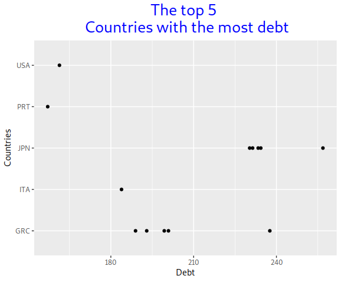
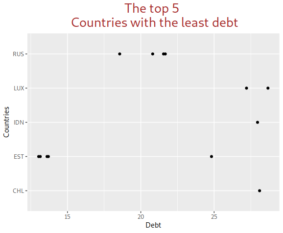

Government\_debt
================
Shivion Morgan

## Introduction

All countries have debt. Wants to see how much debt each country has
over time. Wants to see if the size of the countries plays a role in the
size of the debt.

Debt is calculated as the sum of the following liability categories (as
applicable): currency and deposits; debt securities, loans; insurance,
pensions, standardised guarantee schemes, and other accounts payable.

I Choose to use R. R is a programming language for statistical computing
and graphics supported by the R Core Team and the R Foundation for
Statistical Computing.

## About The dataset

Got the original data set from Organisation for Economic Co-operation
and Development
[oecd](https://data.oecd.org/gga/general-government-debt.htm) website.
The dataset is from 2016 to 2020.

## Packages, libraries & data

-   install tidyverse, ggplot2, and janitor packages

-   some of the libraries I import are: tidyr, dplyr, and readr

-   read\_csv read the .csv data and return a r data frame

-   check to see if the data were successfully obtained

## Data Pre-processing

-   Do all the cleaning in Microsoft excel. Removes all the empty cells
    and missing data, some countries didn’t have enough data, so I
    removed them.

-   Number of observations: 218

-   Variables: 3

-   Change the column name from value to Debt: colnames(Gov)\[3\] =
    “Debt”

## Exploratory Analysis

### 1. Debt for countries

-   Want to see the debt for each countries. Plot the data set in
    Tableau.
-   Sum up all of the debt from 2016 to 2020 to see which countries have
    the most debt. Japan then Greece have the largest amount of debt
    over all.

### 2. 2016 Debt for each countries

-   Want to see how much debt each country has in 2016.
-   Which countries have the most debt in 2016. The data set stared in
    2016. Japan has 231.4 %, Greece has 188.9% and Italy has 154.6%.

### 3. 2020 Debt for each countries

-   Want to see how much each country’s debt has change from 2016
    to 2020.
-   The data set ended in 2020. Japan went up 256.9% from 231.4%, Greece
    went to 237.6% from 188.9%, and Italy went to 183.9% from 154.6%
-   Want to see which of the three countries went up the most. Italy
    went up the most to 29.3%, Japan at 25.5% and Greece at 48.7%.

### 4. The top 10 countries with the most debt

-   Want to see which country has the most debt, I plot it with ggplot2.
-   The top 5 countries with the most debt are; Japan, Greece, Italy ,
    The United States and Portugal.
-   Use the slice\_max function to plot this data.

### 5. The top 10 countries with the least debt

-   Want to see which country has the least amount of debt
-   The top 5 Countries with the least amount of debt are; Russia,
    Estonia, Luxembourg, Indonesia, and Turkey.
-   Use the Slice\_min function to plots this data.

## Conclusion

By using RStudio, Tableau and excel. I analyzed and visualized the open
data of the government debt. After I analyzed the data, Italy went up
29.3% from 2016 to 2020. I enjoy doing this type of project. Thanks for
reading my project!
